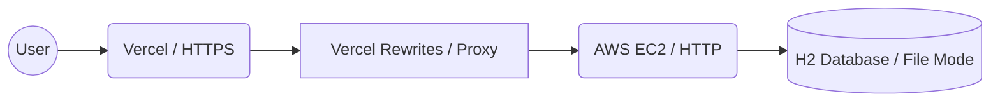
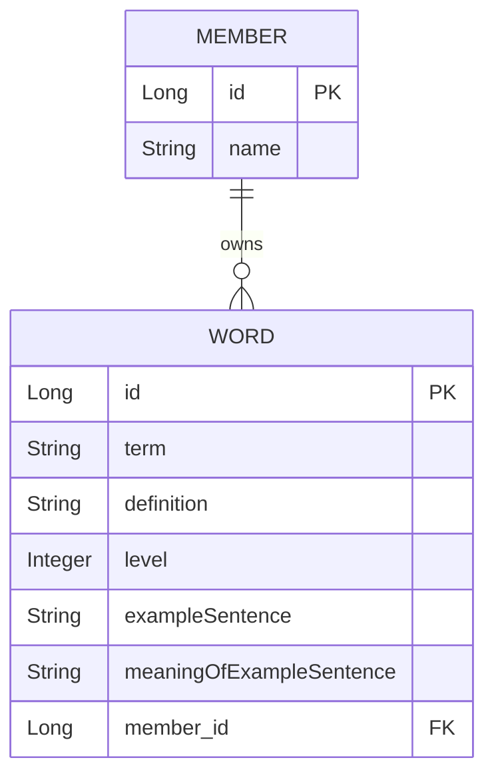

# 📔 MyEnglishVocab (나만의 맞춤형 예문 단어장)

> **“단어만 외우는 시대는 끝났다.”**  
> 사용자가 직접 예문을 구성하고, 퀴즈를 통해 학습 효율을 극대화하는 **풀스택 영어 학습 플랫폼**

---

## 🔗 Repository & Live Demo
* **Frontend**: [GitHub Repository](https://github.com/MyEnglishVocab-Project/MyEnglishVocab)
* **Backend**: [GitHub Repository](https://github.com/MyEnglishVocab-Project/MyEnglishVocab-Server)
* **Live Demo**: [https://my-english-vocab.vercel.app](https://my-english-vocab.vercel.app)

---

## 1. 💡 Project Motivation (프로젝트 동기)

> **“공부하고 싶은 방식대로 작동하는 앱이 없어서 직접 만들었습니다.”**

### 불편함에서 시작된 도전
영어 단어와 예문을 함께 보며 **뜻을 가리고 추론하는 저만의 공부법**을  
시중의 영어 학습 앱들이 온전히 지원하지 못한다는 점에서 출발했습니다.

### 학습의 확장
프론트엔드 공부를 시작하며 *“내가 직접 만들어보자”*는 설렘으로 첫 발을 뗐고,  
이후 백엔드 지식을 습득하며 단순한 UI를 넘어 **데이터가 살아 움직이는 완전한 풀스택 서비스**로 프로젝트를 확장했습니다.

### 지식의 증명
공부한 기술(React, Spring Boot)을 실제 서비스에 적용하며  
**아키텍처 설계부터 배포·트러블슈팅까지 개발 전 과정을 주도적으로 경험**하는 것을 목표로 했습니다.

---

## 2. ✨ Key Features (핵심 기능)

- **Custom Context Learning**  
  고정된 사전식 정의가 아닌, 사용자가 직접 익숙한 뜻과 예문을 입력하여  
  기억의 휘발성을 최소화합니다.

- **Interactive Quiz Mode**  
  단어·예문을 먼저 노출하고, 인터랙티브한 조작으로 뜻을 확인하는 퀴즈 기능을 통해  
  메타인지를 높입니다.

- **Profile-based Management**  
  개별 프로필 기능을 통해 학습자별 또는 목적별로 단어장을 분리하여 관리할 수 있습니다.

- **Responsive Card UI**  
  모바일 환경에서도 쾌적한 학습을 위해  
  테이블 레이아웃을 카드 뷰로 전환하는 반응형 디자인을 적용했습니다.

---

## 3. 🏗 System Architecture & Tech Stack  
*(아키텍처 및 기술 스택)*

### [Architecture Diagram]

### Tech Stack

- **Frontend**
  - React, TypeScript, Vite, Axios
  - React Router, CSS Moduls(Responsive Design)

- **Backend**
  - Java 21
  - Spring Boot 3.5.9
  - Spring Data JPA
  - H2 Database (File mode)

- **Infrastructure**
  - AWS EC2 (Amazon Linux 2023)
  - Vercel (CI/CD)

---

## 4. 🚀 Deployment Strategy  
*(배포 환경 및 선정 이유)*

> **“왜 Vercel과 AWS EC2인가?”**  
단순 배포를 넘어 **실무적인 인프라 경험**을 목표로 선택했습니다.

### Vercel (Frontend)
- 최신 프론트엔드 프레임워크에 최적화된 CI/CD 경험
- 글로벌 CDN을 통한 빠른 로딩 속도 확보

### AWS EC2 (Backend)
- Linux 서버 직접 제어
- 포트 포워딩, 백그라운드 프로세스 관리(`nohup`) 등  
  **서버 운영 전반을 실습하기 위한 선택**

### Vercel & AWS EC2 조합
- 프론트엔드의 빠른 CI/CD 파이프라인(Vercel)과 백엔드의 자유로운 서버 제어권(AWS EC2)을 모두 확보하기 위해 하이브리드 클라우드 구조를 선택

### Mixed Content 이슈 해결
- Vercel(HTTPS) ↔ EC2(HTTP) 통신 시 발생하는 **Mixed Content 보안 이슈**
- 별도의 SSL 발급 비용 없이 Vercel Rewrites(Proxy) 설정을 통해 아키텍처적으로 보안 정책을 준수하며 통신을 성공

### SPA 라우팅 대응
- 새로고침 시 발생하는 404 에러를 방지하기 위해 서버 측 rewrites 설정을 적용하여 클라이언트 사이드 라우팅을 안정화

---

## 5. 📊 Database Schema (ERD)

---

## 6. 🛠 Troubleshooting (예고편)

> 현재 진행 중인 분석 결과를 바탕으로 아래 사례들을 정리할 예정입니다.

- Mixed Content 해결 과정
- SPA 새로고침 시 404 이슈
- H2 Database 데이터 유지 관리 전략

---

## 7. 📅 Future Roadmap (향후 로드맵)

- [ ] **보안 강화**  
  JWT 기반 로그인 / 회원가입 기능 도입

- [ ] **AI Integration**  
  OpenAI API 연동  
  → 단어에 맞는 자연스러운 예문 및 해석 자동 생성

- [ ] **Daily Learning Routine**  
  하루 10단어씩 중복 없이 학습 가능한  
  스케줄링 및 알림 알고리즘 구현
